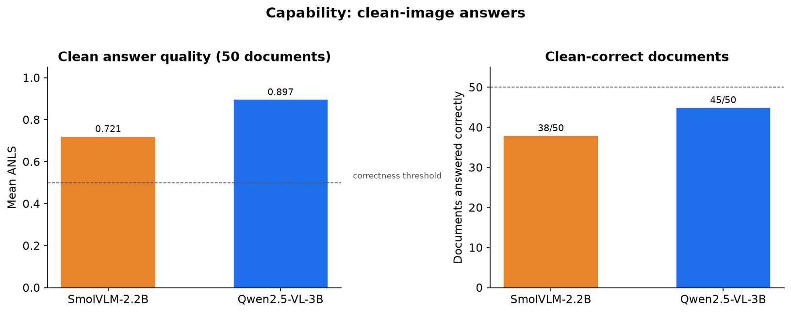
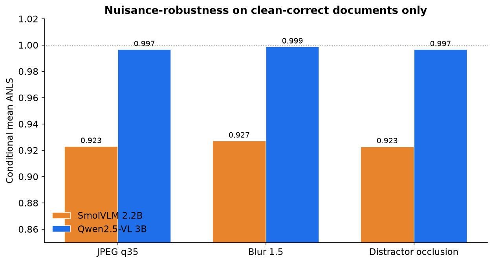
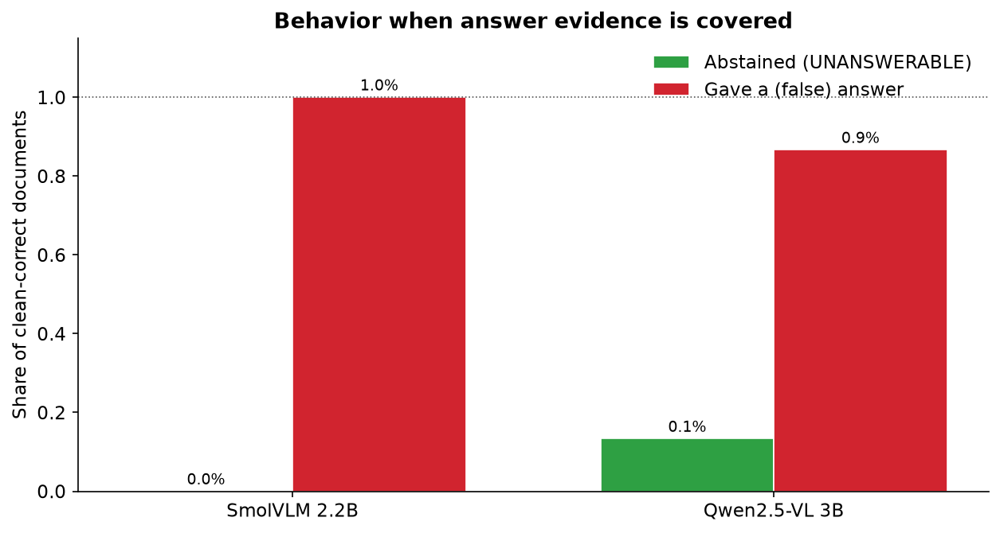
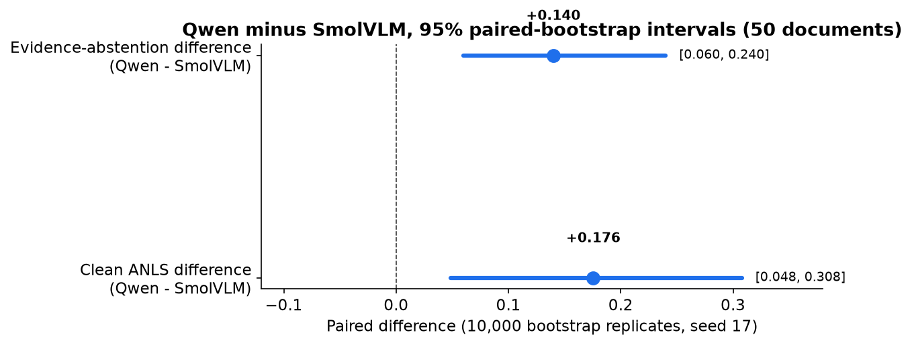
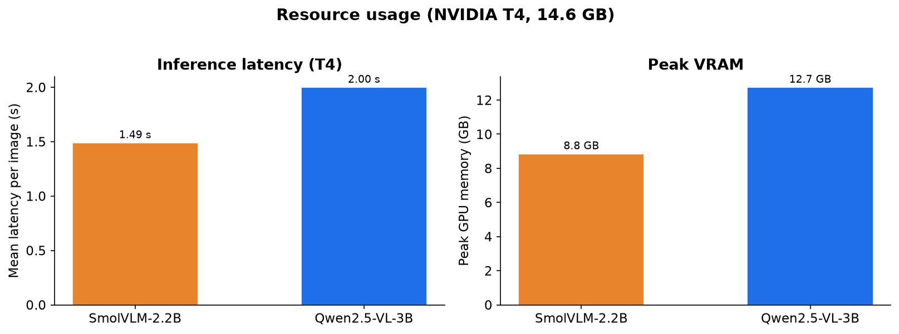

# DocTrust-VLM

A compact, evidence-conditioned robustness study for document vision-language models.

## Research question

Can a small document VLM distinguish between:

1. **nuisance corruption** — the answer should remain unchanged;
2. **damage to irrelevant text** — the answer should remain unchanged;
3. **destruction of answer evidence** — the model should abstain instead of hallucinating?

The first milestone is an evaluation study, not a chatbot and not a claim of a new model. It uses paired transformations so that damage to an answer region can be compared with equally sized damage elsewhere on the same document.

## Status

The completed Colab run compared SmolVLM 2.2B and Qwen2.5-VL 3B on 50 manually audited source documents × five paired variants (500 predictions). Qwen achieved clean mean ANLS 0.8969 versus 0.7213 for SmolVLM, a paired difference of +0.1756 with a 95% bootstrap interval of [+0.0485, +0.3079]. Full raw predictions, metrics, metadata, and limitations are published in [`reports/final-50/RESULTS.md`](reports/final-50/RESULTS.md).

[](https://colab.research.google.com/github/TharunChougoni/doctrust-vlm/blob/main/notebooks/doctrust_colab.ipynb)

The repository is public, so the Colab notebook clones it directly without credentials or secrets.

## Results (final 50-document run)

| Metric | SmolVLM 2.2B | Qwen2.5-VL 3B |
|---|---:|---:|
| Clean-correct documents | 38 / 50 | 45 / 50 |
| Clean mean ANLS | 0.7213 | 0.8969 |
| JPEG q35 conditional ANLS | 0.9229 | 0.9966 |
| Blur 1.5 conditional ANLS | 0.9271 | 0.9987 |
| Distractor conditional ANLS | 0.9228 | 0.9966 |
| Evidence-occlusion abstention | 0.0% | 14.0% |
| Evidence-occlusion false answers | 100.0% | 86.7% |
| Mean latency per image | 1.49 s | 2.00 s |
| Peak GPU memory | 9.05 GB | 13.04 GB |

Qwen's paired clean-ANLS advantage was **+0.176** (95% bootstrap interval [+0.048, +0.308]) on this selected subset. Neither model abstains reliably when answer evidence is removed — the main evidence-grounding limitation.











Full raw predictions, manifests, configs, model revisions, metrics, and limitations are published in [`reports/final-50/RESULTS.md`](reports/final-50/RESULTS.md).

## Models

- Local baseline: [`HuggingFaceTB/SmolVLM-500M-Instruct`](https://huggingface.co/HuggingFaceTB/SmolVLM-500M-Instruct)
- Colab model 1: [`HuggingFaceTB/SmolVLM-Instruct`](https://huggingface.co/HuggingFaceTB/SmolVLM-Instruct) (2.2B, FP16)
- Colab model 2: [`Qwen/Qwen2.5-VL-3B-Instruct`](https://huggingface.co/Qwen/Qwen2.5-VL-3B-Instruct) (3B, FP16)
- Deferred fallback: [`ibm-granite/granite-vision-3.2-2b`](https://huggingface.co/ibm-granite/granite-vision-3.2-2b)

The 500M checkpoint's official card reports roughly 1.23 GB GPU RAM, while the 2.2B card reports a 5.02 GB minimum. A 6 GB laptop GPU has insufficient practical headroom once the display, CUDA context and document activations are included; the 2.2B FP16 run therefore targets a Colab T4-class GPU.

## Repository map

```text
configs/                 model and experiment settings
data/manifests/          JSONL experiment manifests
docs/                    runbook, learning guide, and study design
notebooks/               one main, linear MVP notebook
scripts/                 environment checks (run manually)
src/doctrust/            corruption, inference, and evaluation code
tests/                    lightweight tests (not run during setup)
results/                  generated predictions and metrics (gitignored)
```

## Shared Python environment

This project intentionally lives inside the existing Hugging Face course folder and reuses:

```text
/home/tharun/Projects/hf-course/hf.venv
```

Activate it in Fish:

```fish
source /home/tharun/Projects/hf-course/hf.venv/bin/activate.fish
cd /home/tharun/Projects/hf-course/doctrust-vlm
```

Install dependencies only when you are ready:

```fish
python -m pip install -r requirements.txt
```

## Run order

### Recommended: Colab two-model comparison + 50 examples

Open [`notebooks/doctrust_colab.ipynb`](notebooks/doctrust_colab.ipynb), choose a GPU runtime, and run it from top to bottom. It fetches 50 deterministic unique-image examples, paginates every OCR-derived evidence box for manual approval, runs five paired variants through both models one at a time, and exports a complete reproducibility ZIP.

### Local learning notebook

Open [`notebooks/doctrust_mvp.ipynb`](notebooks/doctrust_mvp.ipynb) for the one-source SmolVLM-500M workflow. It is useful for learning and pipeline debugging, not for the final robustness claim.

In VS Code, select this existing kernel:

```text
/home/tharun/Projects/hf-course/hf.venv/bin/python
```

For browser JupyterLab, install `requirements-notebook.txt`. See [`notebooks/README.md`](notebooks/README.md).

### Alternative: command line

Read [`docs/LEARNING_GUIDE.md`](docs/LEARNING_GUIDE.md), then follow [`docs/RUNBOOK.md`](docs/RUNBOOK.md).

The equivalent commands are:

```fish
# 1. Check environment; does not download a model
python scripts/check_environment.py

# 2. Fetch 50 unique DocVQA examples and derive OCR answer boxes
python scripts/fetch_docvqa_samples.py \
  --count 50 \
  --scan 300 \
  --acknowledge-docvqa-terms
# Visually audit every generated evidence box before continuing.

# 3. Generate clean/corrupted image variants
PYTHONPATH=src python -m doctrust.prepare --config configs/mvp.yaml

# 4. Run one model over the prepared manifest
PYTHONPATH=src python -m doctrust.run --config configs/mvp.yaml

# 5. Aggregate ANLS and abstention metrics
PYTHONPATH=src python -m doctrust.evaluate \
  --predictions results/predictions.jsonl \
  --output results/metrics.json
```

## Input manifest

One JSON object per line:

```json
{
  "id": "doc-001-q1",
  "image_path": "data/raw/doc-001.png",
  "question": "What is the invoice total?",
  "answers": ["4250", "4,250"],
  "evidence_box": [0.58, 0.72, 0.88, 0.81]
}
```

`evidence_box` is normalized `[x1, y1, x2, y2]`, where every coordinate is between 0 and 1. It should tightly surround the answer text—not the whole page.

## Honest scope

- Synthetic corruption is not the same as real deployment data.
- Evidence boxes must be audited; weak OCR matching is not human ground truth.
- A 50-item, two-model run is a credible course/deadline proof of concept, not a statistically strong benchmark.
- No fine-tuning is included in the MVP.
- Qwen is a direct inference comparator; PaddleOCR-VL and Granite remain deferred.

## License

Code is MIT-licensed. Model weights and source datasets retain their own licenses and must not be redistributed from this repository.
